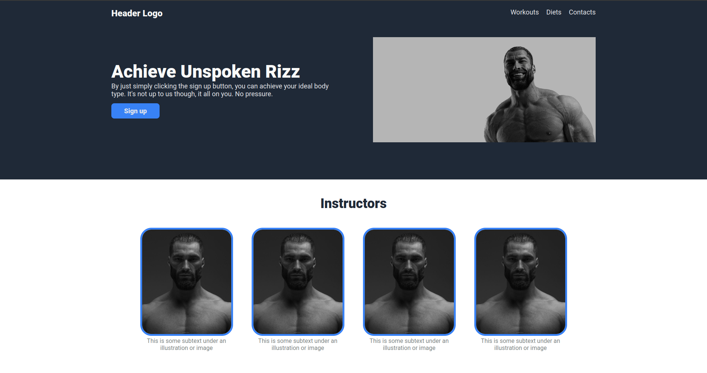

# Gigachad Landing Page

The Odin Project created an assingment to create a [landing page](https://www.theodinproject.com/lessons/foundations-landing-page). 
Although you have to follow a similar page layout they have given you, you are allowed to customize everything else. 
_Obviously_..... I CHOSE TO MAKE A WEBSITE DEDICATED TO WORKING OUT LIKE A **GIGACHAD**.
 

